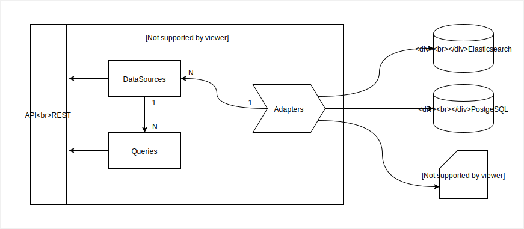

# DataSourceAPI

## Objetivo

Este componente é responsável por gerenciar conexões com fontes de dados diversas e realizar consultas de dados.

Está implementado no componente diversos **Adaptaders** de dados e novos podem ser implementados em JavaScript.
Os Adaptaders atuais são de Elasticsearch, HTTP Get request e PostgreSQL.
Os adaptdores definem como é feita a conexão a uma fonte de dados e como é feito a consulta destes dados.

**DataSources** são entidades cadastradas no serviço que são instâncias da conexão de um Adapter.
O DataSource deve ter os atributos necessários para se conectar à uma fonte de dados, esses atributos são definidos pelo seu adapter.
O Adapter de Elasticsearch, por exemplo, define que seus DataSources tenham a URL e o Index de um banco Elasticsearch.

**Queries** são entidades cadastradas no serviço que representam consultas a serem feitas sobre um DataSource.
A Query deve ter os atributos necessários para especificar uma consulta à uma fonte dados, esta definida pelo seu DataSource.
O Adapter de Elasticsearch, por exemplo, define que as Queries criadas sobre DataSources de Elasticsearch tenham uma Query e um Type de uma instância Elasticsearch.

Ao executar uma Query o Adapter utilizará a especificação do DataSource para se conectar na fonte de dados e a especificação da Query para consultar os dados.
A conexão com o banco pode ser feita na inicialização deste serviço ou antes de cada consultas. Isto é definido pelo Adapter.

Este componente possui uma API para ser consumida, ela basicamente controla o gerenciamento de DataSources e Queries.

## Arquitetura

## Documentação da API
Para acessar a documentação Swagger com a aplicação rodando:

http://10.55.71.127:8080/?url=http://localhost:4000/api/swagger#/default

Substitua `localhost:4000` pelo endereço e porta que a aplicação está rodando.

## Como implementar um novo Adapter

Os Adapters são objetos que especificam os dados necessários para criar DataSources e Queries de uma fonte de dados.
Eles possuem funções que são reponsáveis por se conectar, substituir parâmetros de consulta e realizar consultas em uma fonte de dados a partir dos dados fornecidos pelas entidades.

| Atributo                   | Descrição                                                                                                                        |
|----------------------------|----------------------------------------------------------------------------------------------------------------------------------|
| displayName                | Nome para ser usado na exibição em GUI.                                                                                          |
| name                       | Nome identificador do adapter que dever ser referenciado pelos DataSources. Deve ser único entre outros Adapters.                |
| dataSourcePropertiesSchema | Schema do Mongoose para especificar os atributos de configuração de DataSources. Exemplo: url de conexão, nome do database...    |
| queryPropertiesSchema      | Schema do Mongoose para especificar os atributos de configuração de Queries. Por exemplo: SQL, objeto de query do Elasticsearch. |
|                            |                                                                                                                                  |
|                            |                                                                                                                                  |
|                            |                                                                                                                                  |
|                            |                                                                                                                                  |

Gerado com:
http://www.tablesgenerator.com/markdown_tables